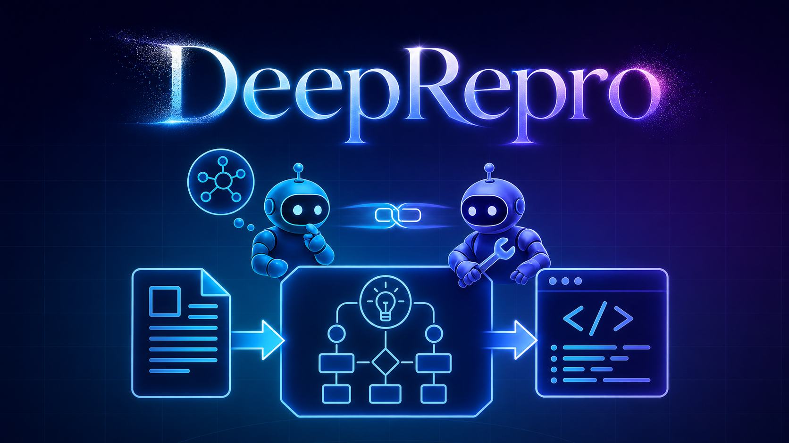

<div align="center">



# DeepRepro

### Automatic ML Paper-to-Code Reproduction via Deep Subplanning

<p>
  <a href="#quick-start">Quick Start</a> ·
  <a href="#workflow-modes">Workflow Modes</a> ·
  <a href="#configuration">Configuration</a> ·
  <a href="#acknowledgements">Acknowledgements</a>
</p>

</div>

---

## Overview

DeepRepro turns a scientific paper into a runnable code repository through a structured multi-agent workflow.  
It combines paper understanding, repository-level blueprint planning, round-level subplanning, tool-mediated implementation, asynchronous memory management, and automatic repair.

## Highlights

- 🧠 **Multi-agent collaboration** — dedicated agents handle analysis, planning, execution, memory, and repair.
- 🧭 **Deep subplanning** — each round can produce a structured subplan with explicit file-level guidance.
- 🛠️ **Automatic issue repair** — diagnostics feed back into later rounds to correct interface or implementation gaps.
- 💾 **Efficient memory management** — implementation summaries are compressed asynchronously to avoid blocking execution.
- 👀 **Process visibility** — the UI surfaces progress, generated files, diagnostics, and run-time state.

## Workflow Modes

DeepRepro provides four paper-to-code modes:

| Mode | Subplanning | Reference indexing | Description |
| --- | --- | --- | --- |
| `raw_fast` | Lightweight | No | Fast generation without reference-code indexing. |
| `infer_fast` | Lightweight | Yes | Fast generation with reference-code indexing. |
| `raw_deepplan` | Deep | No | Deep-planning generation without reference-code indexing. |
| `infer_deepplan` | Deep | Yes | Deep-planning generation with reference-code indexing. |

Fast modes keep the loop lightweight. DeepPlan modes add a subplan agent that writes round-level instructions for the execute agent and coordinates diagnostics and repairs.

## Quick Start

```bash
python ./deeprepro.py --local
```

This starts the local backend and frontend.

- Frontend: `http://localhost:5173`
- Backend: `http://localhost:8000`

## Requirements

- Python 3.9+
- Node.js and npm
- Local model configuration in `mcp_agent.config.yaml` and `mcp_agent.secrets.yaml`

## Configuration

1. Edit `mcp_agent.secrets.yaml` and fill in the provider API key(s) you want to use locally.
2. Adjust `mcp_agent.config.yaml` if you want to change providers, model names, or MCP server settings.
3. Do not commit real private API keys to a public fork.

`mcp_agent.config.yaml` controls the provider, model defaults, document segmentation, and MCP servers.

## Repository Layout

- `deeprepro.py`: local launcher.
- `ui/`: frontend and backend services.
- `workflows/`: orchestration logic.
- `tools/`: PDF processing, indexing, and utility helpers.
- `prompts/`: agent prompt templates.
- `assets/`: public logos and illustration assets.
- `docs/`: evaluation notes and benchmark guidance.
- `uploads/`: local task uploads and intermediate files.

## Acknowledgements

DeepRepro is built on top of [HKUDS/DeepCode](https://github.com/HKUDS/DeepCode) and also takes inspiration from [going-doer/Paper2Code](https://github.com/going-doer/Paper2Code). We thank these projects for their valuable contributions to open scientific code generation and paper-to-code reproduction.

## License

See `LICENSE` for details.


